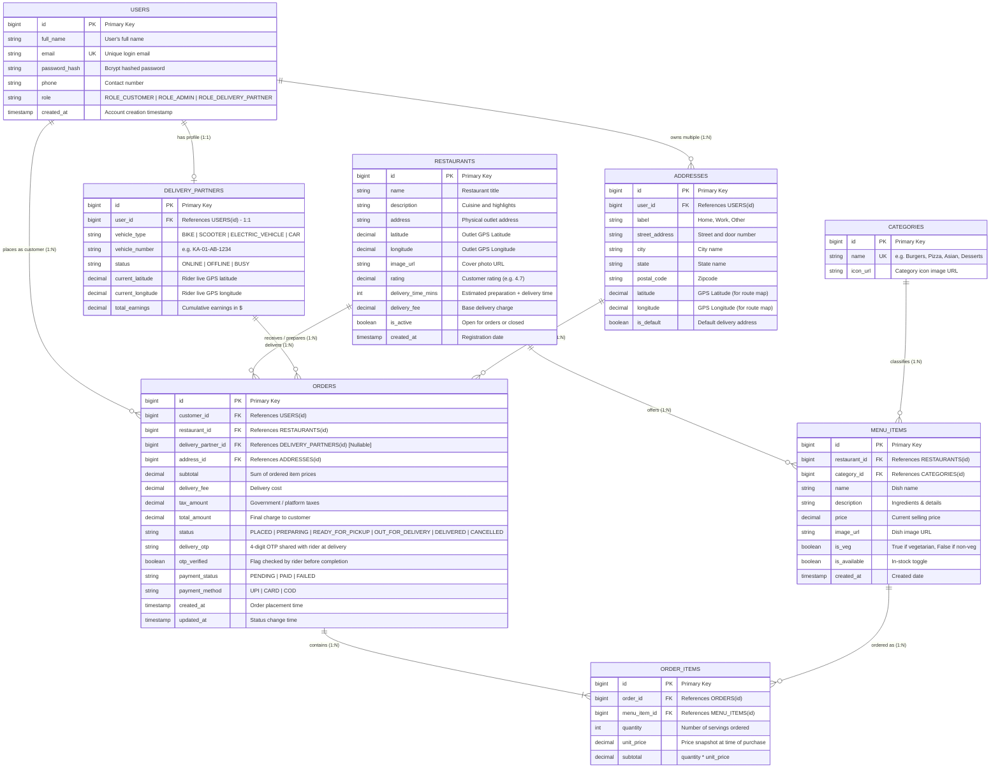

# 📊 Database Schema Entity-Relationship (ER) Diagram

This document contains the visual Entity-Relationship (ER) diagram for our **Food Delivery Platform**, detailing all 8 core tables, their attributes, primary keys (PK), foreign keys (FK), unique constraints (UK), and relationships across the **Customer**, **Admin**, and **Delivery Partner** panels.

---

## 🗺️ Entity-Relationship (ER) Diagram

---

## 🔗 Table Relationships Explained

### 1. `USERS` ⟷ `DELIVERY_PARTNERS` (One-to-One / `1:1`)
- Every delivery partner is fundamentally a `User` (for authentication, email, password, phone).
- The `DELIVERY_PARTNERS` table stores rider-specific data (vehicle number, status, GPS coordinates, earnings) linked via `user_id`.

### 2. `USERS` ⟷ `ADDRESSES` (One-to-Many / `1:N`)
- A single customer can save multiple addresses ("Home", "Work", "Parents' Place").
- When checking out, the customer selects one address ID, which gets recorded on the `ORDERS` table.

### 3. `RESTAURANTS` ⟷ `MENU_ITEMS` (One-to-Many / `1:N`)
- A restaurant has many dishes on its menu.
- If a restaurant is removed or closed, its menu items are tied to it via `restaurant_id` foreign key.

### 4. `CATEGORIES` ⟷ `MENU_ITEMS` (One-to-Many / `1:N`)
- Each menu item belongs to a category (e.g. "Cheeseburger" belongs to "Burgers").
- Helps the customer filter by category with a single click.

### 5. `ORDERS` ⟷ `ORDER_ITEMS` ⟷ `MENU_ITEMS`
- An order contains multiple items (e.g. 2 Burgers + 1 Coke).
- `ORDER_ITEMS` is an associative entity that connects `ORDERS` and `MENU_ITEMS`.
- Crucially, it stores `unit_price` as a **price snapshot** so changes to the restaurant menu never tamper with historic receipts.

### 6. `ORDERS` ⟷ `DELIVERY_PARTNERS` (Many-to-One / `N:1`, Nullable)
- When an order is initially `PLACED` or `PREPARING`, `delivery_partner_id` is `NULL`.
- Once the kitchen marks the order `READY_FOR_PICKUP`, an active delivery rider accepts it, and their ID is assigned to `orders.delivery_partner_id`.
- The rider sees the customer's drop-off coordinates, approaches their door, requests the 4-digit `delivery_otp`, and marks it `DELIVERED`.
